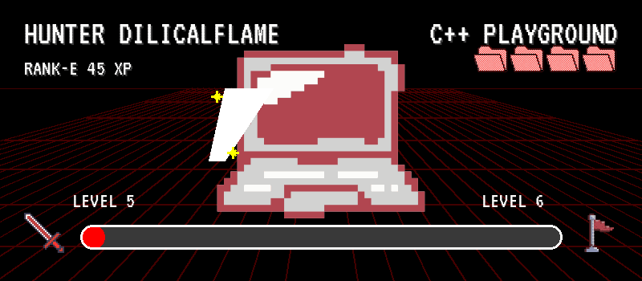

# CPP Playground



This is my personal playground for C++ code snippets.
It is not meant to be a complete project,
but rather a collection of small examples and experiments
to enhance my knowledge of c++ programming language.

> **Note:** Notes on C++ programming language are available in the [Resources](Resources/README.md) folder.

## Folder Structure

```folder
.
├── 100_The_Foundation/
│   ├── 110_Basic_IO_and_Syntax/
│   ├── 120_Control_Flow_and_Logic/
│   └── 130_Functions_and_Basic_Data_Aggregates/
├── 200_The_Core_Toolkit/
│   ├── 210_Pointers_Memory_and_Linear_Structures/
│   ├── 220_Abstract_Data_Types/
│   ├── 230_Foundational_Algorithms/
│   ├── 240_Non-Linear_Structures_Trees/
│   └── 250_Hashing_and_Graph_Structures/
├── 300_Modern_CPP_and_Design/
│   ├── 310_Resource_Management_and_RAII/
│   ├── 320_Object_Oriented_Programming_OOP/
│   ├── 330_Generic_Programming_with_Templates/
│   └── 340_Exploring_the_STL_and_Advanced_Features/
├── 400_Systems_Programming/
│   ├── 410_Low_Level_File_IO_and_Serialization/
│   ├── 420_Concurrency_and_Multithreading/
│   ├── 430_Networking_and_Protocols/
│   ├── 440_Inter_Process_Communication_IPC/
│   └── 450_Introduction_to_Embedded_Systems/
├── 500_Domain_Specializations/
│   ├── 510_Computer_Graphics/
│   ├── 520_Audio_Programming/
│   ├── 530_Cryptography/
│   └── 540_High_Performance_Computing_HPC/
├── 600_Grand_Challenges/
│   ├── 610_Building_a_Game_Engine/
│   ├── 620_Building_a_Database_Management_System/
│   ├── 630_Building_a_Compiler/
│   └── 640_Building_an_Operating_System_Kernel/
└── Resources/
    ├── Code_Snippets/
    ├── External_Articles_and_Docs/
    └── Language_Notes/
```

## Contents
Contents is organized on the basis of deepest level of the folder structure.

### 110. Basic IO and Syntax
1. [Hello World](100_The_Foundation/110_Basic_IO_and_Syntax/001_hello_world.cpp) - A simple program that prints "Hello, World!" to the console.
2. [Predefined Message](100_The_Foundation/110_Basic_IO_and_Syntax/002_predefined_msg.cpp) - A program that prints a predefined message to the console.
3. [Input and Output](100_The_Foundation/110_Basic_IO_and_Syntax/003_input_output.cpp) - A program that takes user input and prints it to the console.
4. [Sum of Two Numbers](100_The_Foundation/110_Basic_IO_and_Syntax/004_sum.cpp) - A program that takes two numbers as input and prints their sum.
5. [Temperature Conversion](100_The_Foundation/110_Basic_IO_and_Syntax/005_temp_conversion.cpp) - A program that converts temperature between Celsius and Fahrenheit.
6. [Length Conversion](100_The_Foundation/110_Basic_IO_and_Syntax/006_len_conversion.cpp) - A program that converts lengths between Meters and Feet.
7. [Rectangle Area/Perimeter Calculator](100_The_Foundation/110_Basic_IO_and_Syntax/007_rect_peri_calc.cpp) - A program that takes user input and outputs area and perimeter of rectangle.
8. [Floating Point Multiplier](100_The_Foundation/110_Basic_IO_and_Syntax/008_floating_pt_multiplier.cpp) - Prompt the user for two floating point numbers and display product.
9. [Size of Data Types](100_The_Foundation/110_Basic_IO_and_Syntax/009_size-of_data-types.cpp) - Print the size in bytes of char, short, int, long, long long, float, double, and bool.
10. [Limits of Data Types](100_The_Foundation/110_Basic_IO_and_Syntax/010_limits_data-types.cpp) - Print the limits of char, short, int, long, long long, float, double, and bool.
11. [ASCII](100_The_Foundation/110_Basic_IO_and_Syntax/011_ascii.cpp) - Print the ASCII value of a character.
12. [Simple Interest Calculator](100_The_Foundation/110_Basic_IO_and_Syntax/012_simple_interest_calc.cpp) - Calculate simple interest given principal, rate, and time.
13. [Integer Overflow Demo](100_The_Foundation/110_Basic_IO_and_Syntax/013_int_overflow.cpp) - Demonstrates integer overflow in C++.
